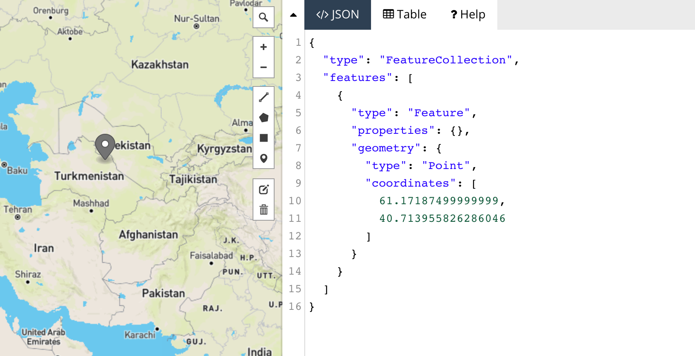

background-image: url(img/1_X9aA5ZRLoidiOEoBi7ywTA.png)
background-size: cover
class: left ,top
# The Geoweb

.footnote[[source](https://medium.com/vis-gl/exploring-geospatial-data-with-kepler-gl-cf655839628f)]
--

- ## .inverse[Part I: Historical Context + Introductory Terminology]

--

- ## .inverse[Part II: Anatomy of a Webmap]

---

background-image: url(img/Comparison-of-GeoWEB-Web-GIS-and-Web-mapping.png)
background-size: cover
class: left ,top
# The Geoweb

.footnote[[source](https://www.researchgate.net/figure/Comparison-of-GeoWEB-Web-GIS-and-Web-mapping_fig10_276364017/download)]

--

- ## Top of the hierarchy

--

- ## Encompasses multiple disciplines, technologies, sectors

--

- ## Relatively nebulous term that can mean different things to different users and developers

---
background-image: url(img/Arpanet_map_1973.png)
background-size: cover
class: left ,top
# The Geoweb - Historical Precedent
.footnote[[source](https://en.wikipedia.org/wiki/ARPANET#/media/File:Arpanet_map_1973.jpg)]

---
background-image: url(img/Arpanet_in_the_1970s.png)
background-size: cover
class: left ,top
# The Geoweb - Historical Precedent
.footnote[[source](https://en.wikipedia.org/wiki/ARPANET#/media/File:Arpanet_in_the_1970s.png)]

---

background-image: url(img/NM.png)
background-size: cover
class: left ,top
# The Geoweb - Historical Precedent
.footnote[[source](https://en.wikipedia.org/wiki/Neuromancer)]

---

background-size: cover
class: left ,top
# The Geoweb - Historical Precedent
.footnote[[source](https://en.wikipedia.org/wiki/Neuromancer)]

 

- ### <i>"The matrix has its roots in primitive arcade games. … **Cyberspace**. A consensual hallucination experienced daily by billions of legitimate operators, in every nation, by children being taught mathematical concepts. … A graphic representation of data abstracted from banks of every computer in the human system. Unthinkable complexity. Lines of light ranged in the nonspace of the mind, clusters and constellations of data. Like city lights, receding."</i>

---

background-image: url(img/spatialization-internet.png)
background-size: cover
class: left ,top
# The Geoweb - Historical Precedent
.footnote[[source](https://citeseerx.ist.psu.edu/viewdoc/download?doi=10.1.1.37.4604&rep=rep1&type=pdf)]

--

- ### US DoD paper, 1994

--

- ### "Spatialization of the Internet"

--

- ### "Synthetic Environments & Large Distributed Simulations"

--

- ### "Scalability in the Communications Architecture"

---

background-size: cover
class: left ,top
# The Geoweb - Historical Precedent

### Advent of WWW + HTML positioned relative to present + ARPANET
 
 

.center[]
.footnote[[source](https://gocoding.org/what-is-internet/)]

---

background-size: cover
class: left ,top
# Web GIS

### Web [web technology]

### +

### GIS [geographic information systems]

#### <b>Web GIS</b> originates from a combination of web technology and the Geographical Information System, which is a recognized technology that is mainly composed of data handling tools for storage, recovery, management and analysis of spatial data. 

.right[]
.footnote[[source](https://www.gislounge.com/difference-web-gis-internet-gis/)]

---

background-size: cover
class: left ,top
# Web GIS - Historical Precedent

- ## Xerox PARC Map Viewer (1993):

.center[]
.footnote[[source](http://digital-archaeology.org/category/web-history/feed/)]

---

background-size: cover
class: left ,top
# Web GIS - Historical Precedent

### Mapquest launched 1996 as first commercial web mapping service:

.center[]
.footnote[[source](http://web.archive.org/web/19971211230909/http://www.mapquest.com/)]

---

background-size: cover
background-image: url(img/mapquest_map.png)
class: left, top
# Web GIS - Historical Precedent
.footnote[[source](http://web.archive.org/web/19971211230909/http://www.mapquest.com/)]
--

- ### Click Map

--

- ### Wait for map to respond

--

- ### Entire page including map reloads

--

- ### Mapped is then panned in one direction or another

---

background-size: cover
class: left, top
# Web GIS - Part I - Web Technology

### 1999 - Advent of AJAX:

 

.center[]

.footnote[[source](https://en.wikipedia.org/wiki/Ajax_(programming)]

---

background-size: cover
class: left, top
# Web GIS - Part I - Web Technology

 

.center[]

.footnote[[source](https://www.w3schools.com/xml/tryit.asp?filename=tryajax_first)]

---

background-size: cover
class: left, top
# Web GIS - Part I - Web Technology

.center[]

.footnote[[source](https://www.w3schools.com/xml/ajax_intro.asp)]

---
background-size: cover
class: left, top
# Web GIS - Part I - Web Technology
## Core Architecture:

.center[]

.footnote[[source](https://www.researchgate.net/figure/Typical-Web-GIS-Architecture_fig1_229020748/download)]

--

- ### Client (a web browser, a desktop application, or a mobile application)

--

- ### GIS Server (identified by a URL) 

--

- ### Communication (Hypertext Transfer Protocol - HTTP/HTTPS)

---

background-image: url(img/desktop.png)
background-size: cover
class: left ,top
# Web GIS - Part II - GIS
## 'Traditional' desktop GIS:

---

background-size: cover
class: left, top
# Web GIS - Part II - GIS
## Web GIS capabilities vs 'traditional' desktop capabilities:

--

- ### Whereas desktop GIS consumes, manipulates and displays data (geodata), web gis often stores data that is then queried via client.

--

- ### Whereas desktop GIS excels at complex geoprocessing, web gis offers robust interactivity for stored data.

--

- ### Whereas desktop GIS offers static cartographic output (PDF, PNG for example), web gis allows for extensive styling and interaction of data classes.

---

background-size: cover
class: left, top
# Web GIS - Milestones

- ## 2003: NASA World Wind Released. An open virtual globe that loads data from distributed resources across the internet.

.right[]

.footnote[[source](https://en.wikipedia.org/wiki/NASA_WorldWind#/media/File:Worldwind.png)]

---

background-size: cover
class: left, top
# Web GIS - Milestones

- ## 2004: OpenStreetMap, an open source, open content world map founded by Steve Coast.

.right[]

.footnote[[source](https://www.openstreetmap.org/#map=19/48.85273/2.35076)]

---

background-size: cover
class: left, top
# Web GIS - Milestones

- ## 2005: Google Maps - The first version. Based on raster tiles organized in a quad tree scheme, data loading done with AJAX.

.right[]

.footnote[[source](https://web.archive.org/web/20051231233521/http://maps.google.com/)]

---

background-size: cover
class: left, top
# Web GIS - Milestones

- ## 2005: Google Earth, first released building on the virtual globe metaphor. The KML (XML based) markup language allows users to integrate their own personal content. 

.right[]

.footnote[[source](https://www.researchgate.net/figure/Google-Earth-display-of-the-maximum-composite-of-CRWs-50-km-satellite-Coral-Bleaching_fig3_238399502/download)]

---

background-size: cover
class: left, top
# Web GIS - Milestones

- ## 2010: MapBox is founded - large provider of custom online maps. Active in MBTiles specification, the TileMill cartography IDE, the Leaflet JavaScript library, and the CartoCSS map styling language and parser.

.right[]

.footnote[[source](https://www.mapbox.com/)]

---

background-size: cover
class: left, top
# Web GIS - Milestones

- ## 2011: CARTO (formerly CartoDB) is a Software as a Service (SaaS) cloud computing platform that provides GIS and web mapping tools for display in a web browser.

.right[]

.footnote[[source](https://carto.com/)]

---

background-size: cover
class: left, top
# Web GIS - Milestones

- ## 2011: Leaflet, the initial release, an open-source JavaScript library for interactive maps.

 

.right[]

.footnote[[source](https://leafletjs.com/)]

---

background-size: cover
class: left, top
# Web Mapping

--

- ### "The advent of **web mapping** can be regarded as a major new trend in cartography. Until recently cartography was restricted to a few companies, institutes and mapping agencies, requiring relatively expensive and complex hardware and software as well as skilled cartographers and geomatics engineers."

--

- ### "A **web map** or an **online map** is both served and consumed, thus web mapping is more than just web cartography, it is a service by which consumers may choose what the map will show."

.footnote[[source](https://en.wikipedia.org/wiki/Web_mapping)]

---

background-image: url(img/web-map-anatomy-0.jpg)
background-size: cover
class: left ,top
# Web Mapping - Anatomy of a Web Map

.footnote[[source](https://gpia-gis.github.io/adv-materials-spring2021/)]

---

background-image: url(img/web-map-anatomy-1.jpg)
background-size: cover
class: left ,top
# Web Mapping - Anatomy of a Web Map

.footnote[[source](https://gpia-gis.github.io/adv-materials-spring2021/)]

---

background-image: url(img/web-map-anatomy-2.jpg)
background-size: cover
class: left ,top
# Web Mapping - Anatomy of a Web Map

.footnote[[source](https://gpia-gis.github.io/adv-materials-spring2021/)]

---

background-image: url(img/web-map-anatomy-3.jpg)
background-size: cover
class: left ,top
# Web Mapping - Anatomy of a Web Map

.footnote[[source](https://gpia-gis.github.io/adv-materials-spring2021/)]

---

background-image: url(img/web-map-anatomy-4.jpg)
background-size: cover
class: left ,top
# Web Mapping - Anatomy of a Web Map

.footnote[[source](https://gpia-gis.github.io/adv-materials-spring2021/)]

---

background-image: url(img/openwhatevermap.png)
background-size: cover
class: left ,top
# Web Mapping - Base Maps

--

 
 
 
 
- ## .inverse[A basemap is a reference map on which users can overlay multiple layers of spatial or geographic data upon, such as vector or raster data.]

.footnote[[source](http://openwhatevermap.xyz/#3/54.88/-16.44)]

---

background-image: url(img/carto_tiles.gif)
background-size: cover
class: left ,top
# Web Mapping - Base Maps

.footnote[[source](https://carto.com/)]

---

background-image: url(img/Tiled_web_map_Stevage.png)
background-size: cover
class: left ,top
# Web Mapping - Base Maps

.footnote[[source](https://en.wikipedia.org/wiki/Tiled_web_map#/media/File:Tiled_web_map_Stevage.png)]
--

 
 
 
 
- ### .inverse[An exaggeration of a tiled web map, in this case the default OpenStreetMap style near Melbourne, Australia. Tiled web maps are normally displayed with no gap between tiles.]

---

background-image: url(img/zoom-tiles.png)
background-size: cover
class: left ,top
# Web Mapping - Base Maps

.footnote[[source](https://forge.autodesk.com/blog/add-mapbox-google-maps-forge-viewer)]

---

background-image: url(img/pyramid-tiles.png)
background-size: cover
class: left ,top
# Web Mapping - Base Maps

.footnote[[source](https://www.researchgate.net/figure/Tile-pyramid-representation_fig1_258725283)]

---

background-size: cover
class: left, top
# Web Mapping - Map Projections

 
.center[]

.footnote[[source](https://www.maptiler.com/google-maps-coordinates-tile-bounds-projection/#14/-16.85/55.17)]

---

background-size: cover
class: left, top
# Web Mapping - Map Projections

 
.center[]

.footnote[[source](https://www.maptiler.com/google-maps-coordinates-tile-bounds-projection/#14/-16.85/55.17)]

---

background-size: cover
class: left, top
# Web Mapping - Data (Geodata)

 
.center[]

.footnote[[source](https://www.maptiler.com/news/2019/02/what-are-vector-tiles-and-why-you-should-care/)]

---

background-size: cover
class: left, top
# Web Mapping - Data (Geodata)

.center[]

.footnote[[source](https://en.wikipedia.org/wiki/GeoJSON)]

---

background-size: cover
class: left, top
# Web Mapping - Data (Geodata)

 
 
.center[]

.footnote[[source](https://geojson.io/#map=4/7.49/25.27)]

---
background-image: url(img/carto_data.png)
background-size: cover
class: left, top
# Web Mapping - Data (Geodata)

.footnote[[source](https://thenewschool.carto.com/)]

--

- ### .inverse[CARTO is an open source software built on PostGIS and PostgreSQL.]

--

- ### .inverse[PostGIS is a spatial database extender for PostgreSQL object-relational database. It adds support for geographic objects allowing location queries to be run in SQL.]

--

---
class: left ,top, inverse
# Lecture 1 End
